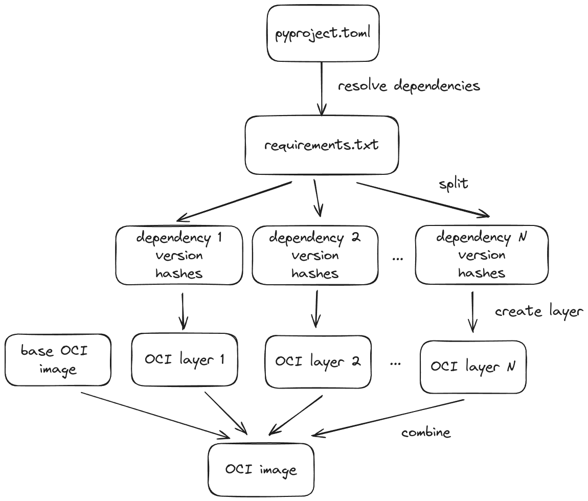

This repository explores ideas on how to keep iteration times low when working with large containerized python applications.

A common technique used to minimize container rebuilds on code changes is to create separate container image layers for the dependencies and the code.
While this works great for code changes, the dependency layer still needs to be rebuilt and transferred when dependencies change.

How can we create more fine grained layers to minimize the amount of data that has to be recomputed and retransferred, even when dependencies change?

The general idea is illustrated below:

## Dependency Resolution

The exact version of each direct and transitive dependency needs to be determined.
This process is referred to as dependency resolution and can be performed by many different tools.

- [uv](https://docs.astral.sh/uv/): `uv pip compile (pyproject.toml|requirements.in) --generate-hashes > requirements.txt`
- [poetry](https://python-poetry.org/): `poetry export --output requirements.txt`
- [rye](https://rye.astral.sh/): `rye lock`
- [pdm](https://pdm-project.org/en/latest/): `pdm lock && pdm export -o requirements.txt`
- [pip-tools](https://github.com/jazzband/pip-tools): `pip-compile (pyproject.toml|requirements.in)`
- [pixi](https://pixi.sh/latest/): does not seem to be supported

## Image Creation

### Docker

Limitations:

- `docker build` imposes a maximum number of about 127 layers in an image.
- `docker build`'s exporting layers performs file system diffing which is incredibly slow.

### Bazel

TODO
